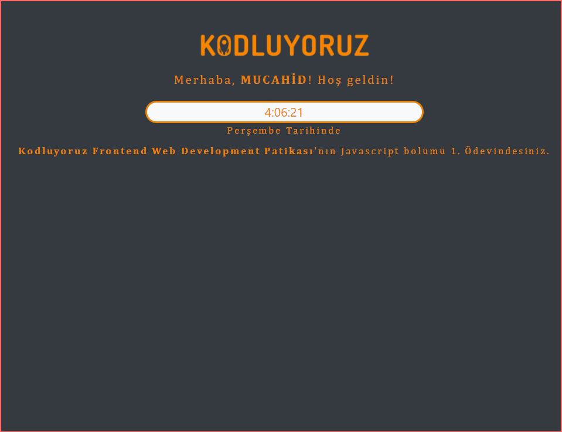
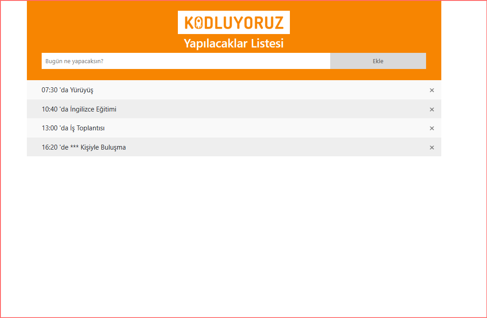
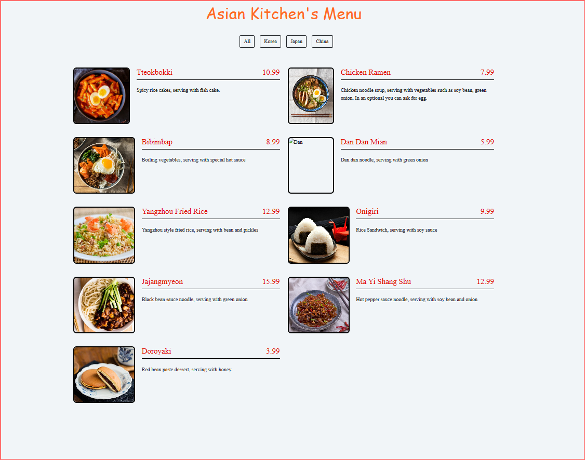

 <br>
 


# Başlangıç Seviye Frontend Eğitimi

1. >  [HTML Ödevleri İçin Tıklayın](https://github.com/mucahidcanbey/baslangic_seviye_frontend_patika#html-%C3%B6devleri%CC%87)

2. >  [CSS Ödevleri İçin Tıklayın](https://github.com/mucahidcanbey/baslangic_seviye_frontend_patika#css-%C3%B6devleri%CC%87)
1. >  [Bootstrap Ödevleri İçin Tıklayın](https://github.com/mucahidcanbey/baslangic_seviye_frontend_patika#bootstrap-%C3%B6devleri%CC%87)

2. >  [JavaScript Ödevleri İçin Tıklayın](https://github.com/mucahidcanbey/baslangic_seviye_frontend_patika#javascript-%C3%B6devleri%CC%87)


<br>

## HTML ÖDEVLERİ

<br>

1. Ödev İlk Web Sayfamızı Oluşturmak


<br>

2. Ödev Kişisel Sayfamızı Detaylandırmak


<br>

3. Ödev Tatlı Tarifi


<br>

## CSS ÖDEVLERİ

<br>

1. Ödev Sayfa Renklendirme


<br>

2. Ödev Eski Google Tasarlamak


<br>

3. Ödev Yeni Google Tasarlamak


<br>

## BOOTSTRAP ÖDEVLERİ

<br>

1. Ödev Siteyi Geliştirme


<br>

2. Ödev Instagram Clone


<br>

3. Ödev Linkedin Clone


<br>

## JAVASCRIPT ÖDEVLERİ

<br>

1. Ödev Saat ve Karşılama



<br>

2. Ödev To Do List



<br>

3. Ödev Asian Kitchen's Menu





<br>


 Bu repo [Patika Academy](https://academy.patika.dev/tr) Başlangıç Seviye Frontend Eğitiminde oluşturduğum ödevler var. 

## 

## Installation

Öncelikle projeyi clonelayın.

```
https://github.com/mucahidcanbey/baslangic_seviye_frontend_patika
```

## Usage
Projeyi cloneladıktan sonra Visual Studio Code programında açınız.

Linux için:
```
cd 
baslangic_seviye_frontend_patika
code .
```
## Contributing
Pull requestler kabul edilir. Büyük değişiklikler için, lütfen önce neyi değiştirmek istediğinizi tartışmak için bir konu açınız.
## License
[MIT](https://choosealicense.com/licenses/mit/)

<hr>


