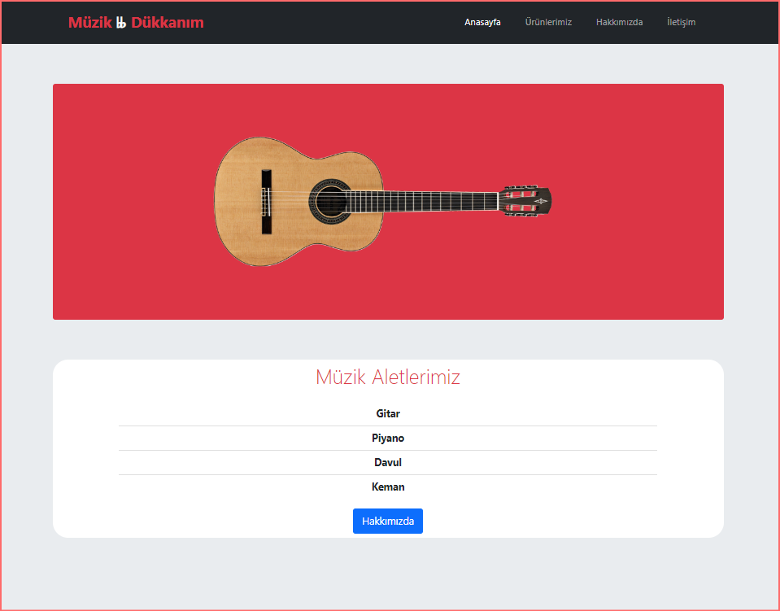

 <br>
 


# Başlangıç Seviye Frontend Eğitimi


<br>

## HTML ÖDEVLERİ

<br>

1. Ödev


<br>

2. Ödev


<br>

3. Ödev


<br>

## CSS ÖDEVLERİ

<br>

1. Ödev


<br>

2. Ödev


<br>

3. Ödev


<br>

## BOOTSTRAP ÖDEVLERİ

<br>

1. Ödev



<br>

2. Ödev


<br>

3. Ödev


<br>


<hr>

 Bu repo [Patika Academy](https://academy.patika.dev/tr) Başlangıç Seviye Frontend Eğitiminde oluşturduğum ödevler var. 

## 

## Installation

Öncelikle projeyi clonelayın.

```
https://github.com/mucahidcanbey/baslangic_seviye_frontend_patika
```

## Usage
Projeyi cloneladıktan sonra Visual Studio Code programında açınız.

Linux için:
```
cd 
baslangic_seviye_frontend_patika
code .
```
## Contributing
Pull requestler kabul edilir. Büyük değişiklikler için, lütfen önce neyi değiştirmek istediğinizi tartışmak için bir konu açınız.
## License
[MIT](https://choosealicense.com/licenses/mit/)

<hr>


